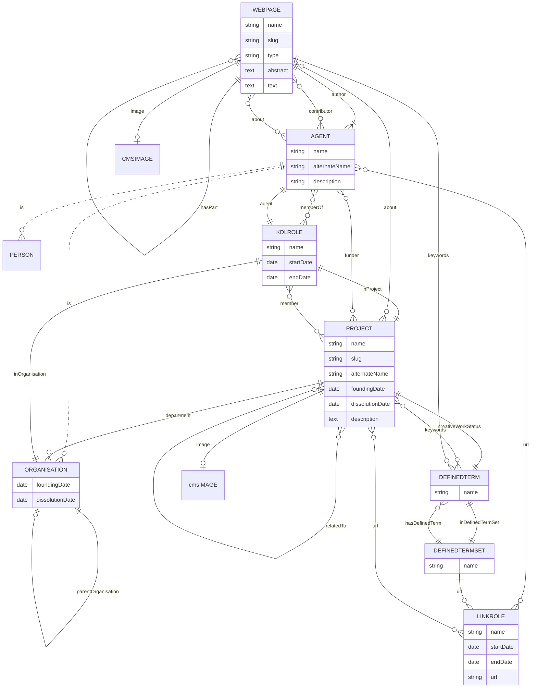

# KDL Web Project

[](https://github.com/kingsdigitallab/kdl/actions/workflows/frontend.yml)
[](https://github.com/kingsdigitallab/kdl/actions/workflows/pages/pages-build-deployment)

[](https://codespaces.new/kingsdigitallab/kdl)

## Set up

### Dependencies

- [Docker](https://www.docker.com/)
- [Node](https://nodejs.org/) 20

Install the node packages:

```bash
npm install
```

Install the git hooks:

```bash
npx simple-git-hooks
```

### Modules

This project is set up as a monorepo with a module for ETL processing and the
frontend module to publish and build a static site.

#### ETL

To process and import data, run:

```bash
npm run etl:clickup frontend/src/projects
```

#### Frontend

To run the frontend, run:

```bash
npm run frontend:dev
```

### Data model

This data model is based on the [schema.org](https://schema.org/) vocabulary.
Local customisations are prefixed with `KDL` and models internal to the CMS
are prefixed with `CMS`.


