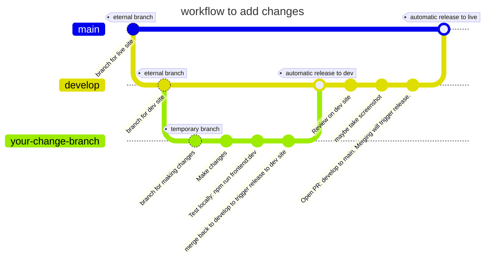
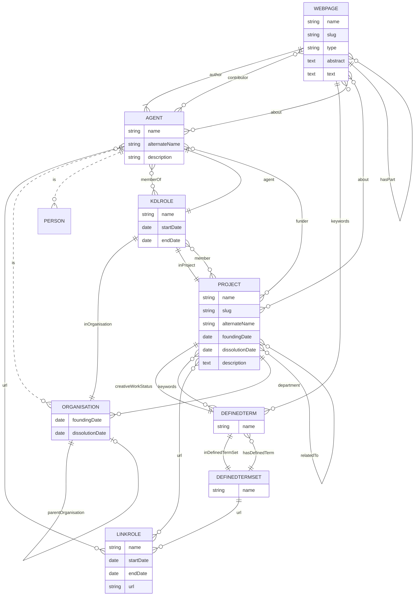

# KDL Web Project

[](https://github.com/kingsdigitallab/kdl/actions/workflows/frontend.yml)
[](https://github.com/kingsdigitallab/kdl/actions/workflows/pages/pages-build-deployment)

[](https://codespaces.new/kingsdigitallab/kdl)

## URLs

- [dev site:](https://kingsdigitallab.github.io/kdl/)

```text
https://kingsdigitallab.github.io/kdl/
```

- [live site:](https://kdl.kcl.ac.uk/)

```text
https://kdl.kcl.ac.uk/
```

## Architecture

The website uses a static-first approach:

1. **Data Source**: [ClickUp](https://clickup.com/) - all content is managed in ClickUp
2. **ETL**: A script fetches data from ClickUp and saves it as JSON files
3. **Frontend**: [11ty](https://www.11ty.dev/) builds static pages from the JSON data

## Set up

### Dependencies

- [Docker](https://www.docker.com/)
- [Node](https://nodejs.org/) 20

Install the node packages:

```bash
npm install
```

Install the git hooks:

```bash
npx simple-git-hooks
```

### Modules

This project is set up as a monorepo with:

- **ETL**: Fetches data from ClickUp and outputs JSON to `frontend/src/_data/`
- **Frontend**: 11ty static site generator

#### ETL

To fetch data from ClickUp:

```bash
npm run etl:clickup
```

This fetches data from the "Website" custom item in ClickUp and saves JSON files to `frontend/src/_data/`.

#### Frontend

To run the frontend locally:

```bash
npm run frontend:dev
```

The site will be available at `http://localhost:8080`.

## Contributing

### Workflow

1. Create a branch from `develop`
2. Make your changes
3. Test [locally](http://localhost:8080/) with `npm run frontend:dev`
   - If this is not set up, just skip this step. If something goes wrong, [merges can be reverted](https://docs.github.com/en/pull-requests/collaborating-with-pull-requests/incorporating-changes-from-a-pull-request/reverting-a-pull-request).
4. [Merge your branch into `develop`](https://docs.github.com/en/pull-requests/collaborating-with-pull-requests/incorporating-changes-from-a-pull-request/merging-a-pull-request)
   - This triggers a deployment to [the dev site](https://kingsdigitallab.github.io/kdl/)
   - Review your changes on the dev site
   - Take a screenshot if the change is complicated  
     (note: adding text only is not complicated. If the page grabs data from somewhere else, it is complicated.)
   - Delete your branch if you are happy. The branch is just clutter now, your changes live in `develop` now. (No need to worry: The branch can be restored if needed.)
5. After reviewing on the dev site, [open a PR ](https://github.com/kingsdigitallab/kdl/pulls) from `develop` to `main`. Now you are done.
   - Add someone as reviewer, this triggers GitHub to email them
   - In the description, add the screenshot from before
   - After the review will be approved, develop can be merged into main  
     (note: the review is purely technical to check whether the changes will render or break the site. Content is not reviewed.)
   - Merging triggers a deployment to [the live site](https://kdl.kcl.ac.uk/)


```mermaid
---
title: workflow to add changes
---

gitGraph
    checkout main
    commit id: "branch for live site " tag: "eternal branch"

    branch develop
    checkout develop
    commit id: "branch for dev site " tag: "eternal branch"

    branch your-change-branch
    checkout your-change-branch
    commit id: "branch for making changes " tag: "temporary branch"
    commit id: "Make changes"
    commit id: "Test locally: npm run frontend:dev"
    commit id: "merge back to develop to trigger release to dev site"

    checkout develop
    merge your-change-branch tag: "automatic release to dev"
    commit id: "Review on dev site"
    commit id: "maybe take screenshot"
    commit id: "Open PR: develop to main. Merging will trigger release."

    checkout main
    merge develop tag: "automatic release to live"
```

### Commands

We usually use VSCode, where you can click in the UI for all these actions. For reference, here are the commands:

```bash
# Create a new branch
git checkout -b my-content-change-branch develop

# Make changes and test locally
npm run frontend:dev

# Commit and push
git add .
git commit -m "description of changes"
git push -u origin my-content-change-branch

# Merge into develop
git checkout develop
git merge my-content-change-branch
git push develop
git branch -d my-content-change-branch
```

### Where to make changes

Some content is managed in ClickUp and synced to the site via ETL, while other content is written directly in markdown files in this repository.

**In ClickUp:**

- Team members (people, roles, organisations)
- Projects (This updates the only `yaml` [frontmatter](https://www.markdownlang.com/advanced/frontmatter.html#yaml-frontmatter) of`frontend/src/projects/projectname.md`)

**In Markdown files:**

- Blog posts (`frontend/src/blog/*.md`)
- FAQ pages (`frontend/src/faqs/*.md`)
- Theme pages (`frontend/src/themes/*.md`)
- Slides/presentations (`frontend/src/slides/*.md`)
- Project descriptions need to be written manually into the automatically created markdown file from above (`frontend/src/projects/projectname.md`). Simply add an empty line below the second triple dash (`---`) and start writing your description.

#### Example: Adding a blog article with an image

1. **Create the markdown file** - Add a new file at `frontend/src/blog/your-title.md` with frontmatter:

```yaml
---
title: Your Article Title
subtitle: A brief subtitle
tags:
  - post
  - Your Topic
authors:
  - Your Name
date: 2026-04-21
excerpt: A short description for previews and SEO.
feature:
  image: /assets/images/blog/your-image.jpg
  title:
  description: Alt text for the image
---
```

2. **Add the image** - Place your image in `frontend/src/assets/images/blog/your-image.jpg`

3. **Check ClickUp** (optional) - If the article references team members or projects, ensure they exist in ClickUp so the ETL can link them properly.

4. **Test locally** - Run `npm run frontend:dev` to preview your changes before merging.

### Data model

The data model is based on the [schema.org](https://schema.org/) vocabulary. Local customisations are prefixed with `KDL`.


```mermaid
erDiagram
    AGENT }o--o{ LINKROLE: url
    AGENT ||..o{ ORGANISATION: is
    AGENT ||..o{ PERSON: is
    AGENT }o--o{ KDLROLE: memberOf
    AGENT {
        string name
        string alternateName
        string description

    }

    ORGANISATION ||--o| ORGANISATION: parentOrganisation
    ORGANISATION {
        date foundingDate
        date dissolutionDate
    }

    DEFINEDTERMSET ||--o{ DEFINEDTERM: hasDefinedTerm
    DEFINEDTERMSET ||--o{ LINKROLE: url
    DEFINEDTERMSET {
        string name
    }

    DEFINEDTERM ||--|| DEFINEDTERMSET: inDefinedTermSet
    DEFINEDTERM {
        string name
    }

    PROJECT ||--|| DEFINEDTERM: creativeWorkStatus
    PROJECT }o--o{ DEFINEDTERM: keywords
    PROJECT }o--o{ LINKROLE: url
    PROJECT ||--o{ ORGANISATION: department
    PROJECT }o--o{ AGENT: funder
    PROJECT }o--o{ KDLROLE: member
    PROJECT }o--o{ PROJECT: relatedTo
    PROJECT {
        string name
        string slug
        string alternateName
        date foundingDate
        date dissolutionDate
        text description
    }

    KDLROLE ||--|| AGENT: agent
    KDLROLE ||--|| ORGANISATION: inOrganisation
    KDLROLE ||--|| PROJECT: inProject
    KDLROLE {
        string name
        date startDate
        date endDate
    }

    LINKROLE {
        string name
        date startDate
        date endDate
        string url
    }

    WEBPAGE ||--|{ AGENT: author
    WEBPAGE }o--o{ AGENT: contributor
    WEBPAGE ||--o{ DEFINEDTERM: keywords
    WEBPAGE }o--o{ AGENT: about
    WEBPAGE }o--o{ PROJECT: about
    WEBPAGE ||--|| WEBPAGE: isPartOf
    WEBPAGE ||--o{ WEBPAGE: hasPart
    WEBPAGE {
        string name
        string slug
        string type
        text abstract
        text text
    }
```
