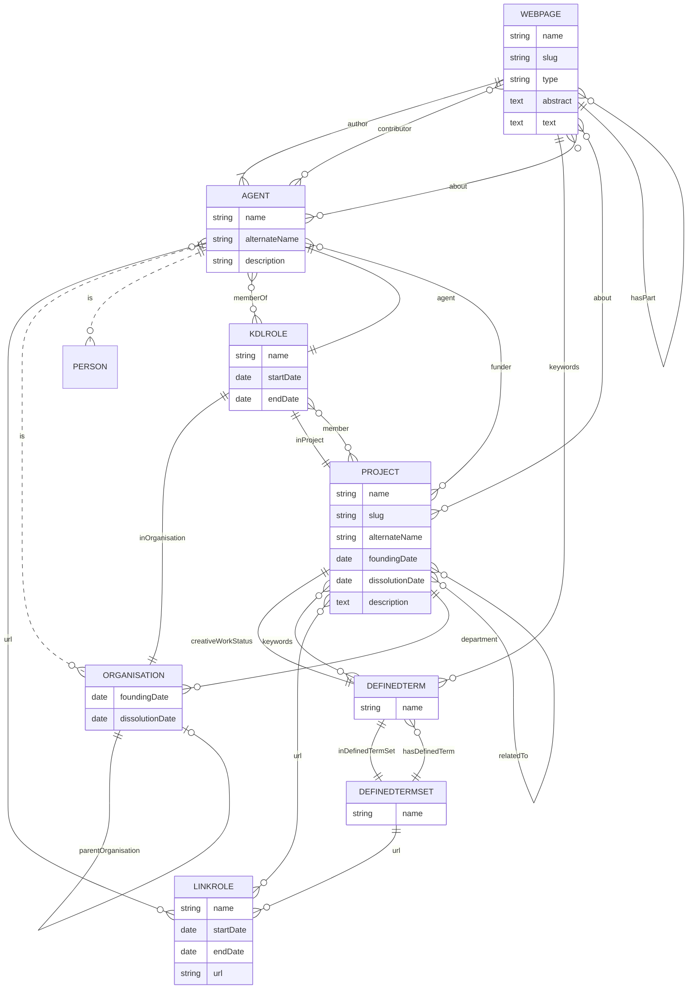

# KDL Web Project

[](https://github.com/kingsdigitallab/kdl/actions/workflows/frontend.yml)
[](https://github.com/kingsdigitallab/kdl/actions/workflows/pages/pages-build-deployment)

[](https://codespaces.new/kingsdigitallab/kdl)

## Architecture

The website uses a static-first approach:

1. **Data Source**: [ClickUp](https://clickup.com/) - all content is managed in ClickUp
2. **ETL**: A script fetches data from ClickUp and saves it as JSON files
3. **Frontend**: [11ty](https://www.11ty.dev/) builds static pages from the JSON data

## Set up

### Dependencies

- [Docker](https://www.docker.com/)
- [Node](https://nodejs.org/) 20

Install the node packages:

```bash
npm install
```

Install the git hooks:

```bash
npx simple-git-hooks
```

### Modules

This project is set up as a monorepo with:

- **ETL**: Fetches data from ClickUp and outputs JSON to `frontend/src/_data/`
- **Frontend**: 11ty static site generator

#### ETL

To fetch data from ClickUp:

```bash
npm run etl:clickup
```

This fetches data from the "Website" custom item in ClickUp and saves JSON files to `frontend/src/_data/`.

#### Frontend

To run the frontend locally:

```bash
npm run frontend:dev
```

The site will be available at `http://localhost:8080`.

## Contributing

### Workflow

1. Create a branch from `develop`
2. Make your changes
3. Test locally with `npm run frontend:dev`
4. Merge into `develop` and delete your branch
   - This triggers a deployment to the dev site
5. After reviewing on the dev site, open a PR from `develop` to `main`

### Commands

We usually use VSCode, where you can click in the UI for all these actions. For reference, here are the commands:

```bash
# Create a new branch
git checkout -b my-feature develop

# Make changes and test locally
npm run frontend:dev

# Commit and push
git add .
git commit -m "description of changes"
git push -u origin my-feature

# Merge into develop
git checkout develop
git merge my-feature
git push develop
git branch -d my-feature
```

### Data model

The data model is based on the [schema.org](https://schema.org/) vocabulary. Local customisations are prefixed with `KDL`.


```mermaid
erDiagram
    AGENT }o--o{ LINKROLE: url
    AGENT ||..o{ ORGANISATION: is
    AGENT ||..o{ PERSON: is
    AGENT }o--o{ KDLROLE: memberOf
    AGENT {
        string name
        string alternateName
        string description

    }

    ORGANISATION ||--o| ORGANISATION: parentOrganisation
    ORGANISATION {
        date foundingDate
        date dissolutionDate
    }

    DEFINEDTERMSET ||--o{ DEFINEDTERM: hasDefinedTerm
    DEFINEDTERMSET ||--o{ LINKROLE: url
    DEFINEDTERMSET {
        string name
    }

    DEFINEDTERM ||--|| DEFINEDTERMSET: inDefinedTermSet
    DEFINEDTERM {
        string name
    }

    PROJECT ||--|| DEFINEDTERM: creativeWorkStatus
    PROJECT }o--o{ DEFINEDTERM: keywords
    PROJECT }o--o{ LINKROLE: url
    PROJECT ||--o{ ORGANISATION: department
    PROJECT }o--o{ AGENT: funder
    PROJECT }o--o{ KDLROLE: member
    PROJECT }o--o{ PROJECT: relatedTo
    PROJECT {
        string name
        string slug
        string alternateName
        date foundingDate
        date dissolutionDate
        text description
    }

    KDLROLE ||--|| AGENT: agent
    KDLROLE ||--|| ORGANISATION: inOrganisation
    KDLROLE ||--|| PROJECT: inProject
    KDLROLE {
        string name
        date startDate
        date endDate
    }

    LINKROLE {
        string name
        date startDate
        date endDate
        string url
    }

    WEBPAGE ||--|{ AGENT: author
    WEBPAGE }o--o{ AGENT: contributor
    WEBPAGE ||--o{ DEFINEDTERM: keywords
    WEBPAGE }o--o{ AGENT: about
    WEBPAGE }o--o{ PROJECT: about
    WEBPAGE ||--|| WEBPAGE: isPartOf
    WEBPAGE ||--o{ WEBPAGE: hasPart
    WEBPAGE {
        string name
        string slug
        string type
        text abstract
        text text
    }
```
