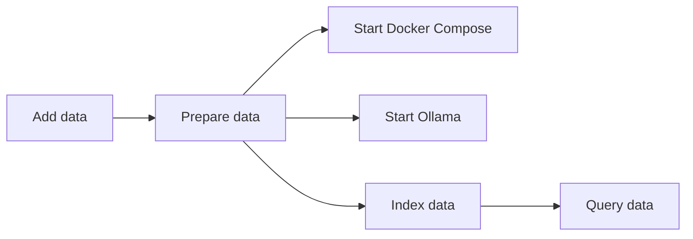

In the evolving landscape of Digital Humanities (DH) and Research Software Engineering (RSE), the integration of advanced AI techniques is opening new avenues for research and data exploration. This blog post explores the process of prototyping a Retrieval-Augmented Generation (RAG) system, with a specific focus on its application to Indigenous data. Our primary goal is to stimulate discussion around the use of AI/ML in the context of sensitive cultural data.

## Project Overview

This prototype RAG system was developed as part of a larger dashboard project, aimed at exploring and discussing the implications of AI/ML technologies when applied to Indigenous data. The system processes historical records about Aboriginal schools operating in the state of New South Wales, Australia, and serves as a case study for the broader conversation about AI ethics and cultural sensitivity in digital humanities.

## Understanding RAG Systems in DH

Retrieval-Augmented Generation (RAG) combines large language models with a knowledge base of specific information. In a DH context, this can be particularly powerful for exploring and analysing historical records, cultural artifacts, or literary works. RAG systems work by first retrieving relevant information from a database, then using this information to generate responses, ensuring answers are grounded in actual historical data.

## Key Aspects of the Prototype

1. **Data Preparation**:

   - Original data was in Word format, converted to JSON for indexing and Markdown for frontend presentation.
   - This conversion process highlights the challenges of standardising diverse historical documents for machine processing.

2. **Ethical Considerations**:

   - The RSE team maintained constant contact with Indigenous, Co-Leads of the [iREAL project](https://kdl.kcl.ac.uk/projects/ireal/), community representatives throughout the development process.
   - This collaboration underscores the importance of involving partners and stakeholders when working with culturally sensitive data.

3. **Performance and Feedback**:

   - A user feedback system was implemented in the frontend, allowing users to rate the helpfulness of each response.
   - While formal evaluation metrics were not implemented at this stage, the project team expressed interest in using more formal evaluation mechanisms (like [Arize Phoenix](https://phoenix.arize.com/)) in future iterations.

4. **Integration with Broader Context**:

   - The RAG system integrates with a wider dashboard, linking AI-generated responses to original records.
   - This feature enhances transparency and allows users to verify information against primary sources.

5. **Prototype Nature and Goals**:

   - The primary objective was to elicit discussion around AI/ML and Indigenous data, rather than to create a production-ready system.
   - This approach allows for exploration of potential benefits and risks without the pressure of immediate practical application.

6. **Challenges and Lessons Learned**:

   - A major challenge was addressing semantic drift, highlighting the complexity of creating a truly useful RAG system beyond basic implementation.
   - This experience underscores the gap between initial setup and developing a system that performs well enough to be genuinely useful in research contexts.

7. **Collaborative Development**:
   - The project involved about 15 days of work from a multi-disciplinary team.
   - This collaborative approach brought diverse perspectives to bear on the challenges of applying AI to cultural heritage data.

## Technical Implementation

### System Architecture Overview

To provide a clear visual representation of the RAG system's architecture, here's a high-level diagram of the process flow:

### Key Components in Implementing a RAG System

When setting up a RAG system for Digital Humanities, consider incorporating these key components:

1. **Document Processing Pipeline**:

   - Implement a robust ingestion pipeline that can handle various document formats.
   - Use document splitters to break down large texts into manageable chunks.
   - Apply transformations to extract metadata, such as entities, keywords, and summaries.

2. **Embedding and Vectorisation**:

   - Choose an appropriate embedding model for your domain.
   - Implement a vector store to efficiently store and retrieve document embeddings.

3. **Retrieval Mechanisms**:

   - Implement multiple retrieval methods, such as vector similarity search and keyword-based retrieval (e.g., BM25).
   - Consider using a fusion of different retrieval methods for more robust results.

4. **Query Processing**:

   - Develop a flexible query engine that can handle various types of queries.
   - Implement query transformation techniques, such as Hypothetical Document Embeddings (HyDE), to improve retrieval.

5. **Response Generation**:

   - Use a language model to generate responses based on retrieved context.
   - Implement a prompt template system to guide the language model's responses.

6. **Evaluation and Iteration**:
   - Implement relevancy evaluators to assess the quality of responses.
   - Use techniques like retry mechanisms to improve response quality.

### Implementation Techniques

Here are some specific techniques you might consider when implementing your RAG system:

1. **Flexible Configuration**: Use environment variables or configuration files to make your system easily adjustable without code changes.

2. **Modular Design**: Structure your code in a modular way, allowing easy swapping of components (e.g., different embedding models or retrieval methods).

3. **Caching**: Implement caching mechanisms to improve performance, especially for resource-intensive operations like document processing.

4. **Asynchronous Processing**: Utilize asynchronous programming techniques for improved performance, especially in data retrieval and processing.

5. **Error Handling and Logging**: Implement robust error handling and logging to facilitate debugging and system monitoring.

6. **Command-Line Interface**: Develop a CLI for easy interaction with your system, allowing operations like indexing, querying, and data export.

7. **Observability**: Integrate tracing and monitoring tools to gain insights into your system's performance and behaviour.

## Designing a User Interface for RAG Systems

A well-designed user interface is essential for making your RAG system accessible and useful to researchers and other users in the Digital Humanities field. Here are some key considerations and features to include in your RAG system's frontend:

1. **Intuitive Query Input**:

   - Provide a clear, prominent input area for users to enter their questions.
   - Consider offering example questions to help users understand the system's capabilities.

2. **Conversation History**:

   - Display a chat-like interface showing the history of questions and answers.
   - Include timestamps and other metadata to provide context for each interaction.

3. **Answer Presentation**:

   - Present AI-generated responses in a clear, readable format.
   - Use markdown or HTML formatting to enhance readability of complex responses.

4. **Source Attribution**:

   - Provide a way to view the source documents or context used to generate each answer.
   - Include links to original documents when possible, enhancing the system's value as a research tool.

5. **User Feedback Mechanism**:

   - Implement a simple way for users to provide feedback on the quality of responses (e.g., thumbs up/down buttons).
   - Use this feedback to improve the system over time and to gather metrics on system performance.

6. **Customisation Options**:

   - Allow users to customise the AI's behaviour, such as by modifying the prompt or specifying the AI's role.
   - Provide access to default settings and explanations of how customisation affects results.

7. **Help and Documentation**:

   - Include a comprehensive help section explaining how to use the system effectively.
   - Provide information about the RAG technique and its limitations to set appropriate user expectations.

8. **Responsive Design**:

   - Ensure the interface works well on various devices and screen sizes.

9. **Accessibility**:

   - Implement proper ARIA labels and ensure the interface is navigable by keyboard.
   - Use semantic HTML to improve screen reader compatibility.

10. **Error Handling and Loading States**:

    - Provide clear feedback when the system is processing a query.
    - Handle and display errors gracefully to maintain a good user experience.

11. **Data Persistence**:

    - Consider using local storage to save chat history and user preferences.
    - Provide options for users to clear their data for privacy.

12. **Ethical Considerations in UI**:
    - Clearly communicate the prototype or experimental nature of the system if applicable.
    - Provide warnings about potential biases or limitations in the historical data. _Note that in an Australian Indigenous context where the names or images of those who have passed may be included in the digital resource that an appropriate warning must be given prior to a user accessing either the data or associated outputs, including the RAG._
    - Encourage critical thinking and verification of important information.

## Ethical Considerations in RAG Setup

When setting up a RAG system, especially when dealing with sensitive historical data, consider these ethical implications:

1. **Respectful data management**: Ensure that AI processing respects the cultural significance of the data.
2. **Human interpretation**: Acknowledge the importance of human interpretation alongside AI-generated insights.
3. **Community involvement**: When dealing with cultural heritage, involve relevant communities in the project decision-making and development, as well as interpretation of results.
4. **Ethical approval**: Seek appropriate ethical approvals, from relevant communities and appropriate institutional ethics boards, before processing sensitive data.
5. **Transparency about limitations**: Clearly communicate the system's potential for errors or biases.
6. **Encouraging critical thinking**: Design the system to prompt users to reflect on the implications of AI in this context.

## Understanding RAG Limitations

Be aware of these common limitations in RAG systems:

1. **Hallucination**: The AI might generate information not present in the source documents.
2. **Context Limitations**: The system can only work with the provided context, which may not always be comprehensive.
3. **Temporal Confusion**: AI may struggle with understanding historical timelines accurately.
4. **Inconsistent Answers**: Responses to similar queries might vary.
5. **Bias in Source Material**: AI responses will reflect biases present in the original documents.

## Conclusion: Fostering Discussion on AI/ML and Indigenous Data

The development of this RAG system prototype serves as a valuable case study in the application of AI/ML technologies to sensitive cultural data. While the system itself is not intended for production use, it successfully highlights key areas for discussion:

1. **Ethical AI Development**: How can we ensure AI systems respect and preserve the cultural context of Indigenous data?

2. **Community Involvement**: What are the best practices for involving community partners in AI projects dealing with cultural heritage?

3. **Balancing Innovation and Sensitivity**: How can we explore the potential of AI in digital humanities while maintaining respect for the communities represented in the data?

4. **Transparency and Accountability**: What mechanisms should be in place to ensure AI systems processing cultural data are transparent and accountable?

5. **Future of AI in Digital Humanities**: How might tools like this shape future research methodologies in digital humanities?

By engaging with these questions, researchers and developers can work towards creating AI systems that not only advance digital humanities research but do so in a way that is ethically sound and culturally respectful.

As we continue to explore the intersection of AI and cultural heritage, projects like this prototype serve as important stepping stones, encouraging critical thinking and fostering crucial discussions about the role of technology in preserving and studying our diverse cultural histories.
